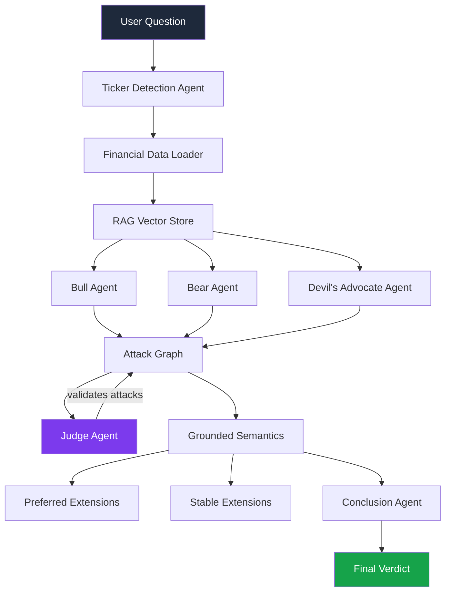

# DebateForge

A multi-agent epistemic debate system that uses Dung's Abstract Argumentation Framework to generate structured, formally defensible investment analysis.

Instead of asking a single LLM for an answer, DebateForge deploys three agents with opposing epistemic stances — Bull, Bear, and Devil's Advocate — who debate a question using formal attack and defense logic. A Judge agent validates each attack, and grounded semantics determines which arguments survive.

Current domain: financial investment analysis — agents are grounded in real market data retrieved via Yahoo Finance, covering revenue trends, profit margins, debt ratios, and other key financial metrics.

---

## Architecture



---

## How It Works

**Formal Argumentation** — Built on Dung's 1995 Abstract Argumentation Framework. Arguments attack each other, and grounded semantics computes which arguments are formally defensible. Unlike standard multi-agent debate, every conclusion has a mathematical basis.

**Three Epistemic Stances** — Bull (optimist), Bear (pessimist), and Devil's Advocate (skeptic) generate arguments from fundamentally different priors. This ensures the debate covers all angles rather than converging prematurely.

**Judge Validation** — A neutral Judge agent evaluates every attack for logical validity before it enters the argument graph. Invalid attacks are discarded.

**Evidence Grounding** — Agents retrieve real financial data via Yahoo Finance before generating arguments, reducing hallucination and anchoring claims in facts.

**Grounded Conclusion** — After debate, a Conclusion agent synthesizes the argument graph into a structured verdict: VERDICT, REASONING, and KEY RISK.

---

## Project Structure

```
Debateforge/
│
├── debateforge/                 # Main package
│   ├── agents/                  # Bull, Bear, Devil, Judge agents
│   ├── argumentation/           # Dung's framework core
│   │   └── semantics/           # Grounded, preferred, stable extensions
│   ├── debate/                  # Debate engine and orchestration
│   ├── retrieval/               # RAG pipeline and financial data loader
│   ├── visualization/           # Argument graph rendering
│   ├── api/                     # FastAPI REST API
│   ├── core/                    # Base classes and exceptions
│   └── config/                  # Settings and environment
│
├── frontend/                    # Streamlit UI
│   └── components/              # UI components
│
├── tests/                       # Unit and integration tests
├── docker/                      # Docker configuration
└── .github/workflows/           # CI/CD pipelines
```

---

## Setup

**Requirements** — Python 3.10+

Clone the repo and set up the environment —

```bash
git clone 
cd Debateforge
python -m venv venv
source venv/bin/activate # macOS/Linux
venv\Scripts\activate # Windows
pip install -r requirements.txt
pip install -e .
```

Configure environment variables —

```bash
cp .env.example .env
# Add your GROQ_API_KEY to .env
```

Run the app —

```bash
streamlit run frontend/app.py
```

---

## Tech Stack

| Component | Technology |
|-----------|------------|
| LLM | Groq — llama-3.1-8b-instant |
| Agent Framework | LangChain |
| Argumentation | Custom implementation of Dung's Abstract Argumentation Framework |
| Financial Data | Yahoo Finance via yfinance |
| Vector Store | In-memory store |
| API | FastAPI |
| UI | Streamlit |
| Testing | pytest |

---

## Key Concepts

**Grounded Extension** — The unique, minimal set of arguments that are collectively defensible. An argument is in the grounded extension if all its attackers are themselves attacked by the defended set.

**Preferred Extension** — Maximal admissible sets. Multiple preferred extensions can exist, representing genuinely different but internally consistent positions.

**Stable Extension** — A conflict-free set that attacks every argument outside itself. Represents the strongest possible consensus.

---

## Future Work

- REST API with FastAPI
- Domain generalization — currently optimized for financial analysis, with plans to extend to legal, medical, and policy domains
- Confidence scoring per argument
- Human-in-the-loop debate injection
- Docker deployment

---

## References

- Dung, P. M. (1995). [On the Acceptability of Arguments and its Fundamental Role in Nonmonotonic Reasoning, Logic Programming and n-Person Games](https://www.sciencedirect.com/science/article/pii/000437029400041X). *Artificial Intelligence*, 77(2), 321–357.
